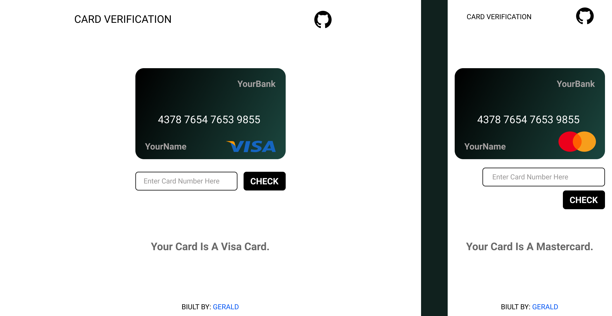

# card-verification

A JavaScript app that verifies card numbers using the " Luhn Algorithm"; currently works with VISA, Mastercard, American Express, and Discover cards.

CHECK IT OUT: [HERE](https://card-verification.vercel.app/)

 
__FEEL FREE TO MAKE CHANGES AND MAKE A PULL REQUEST.__

 
_Note: The number entered is to captured, saved or stored any where._
