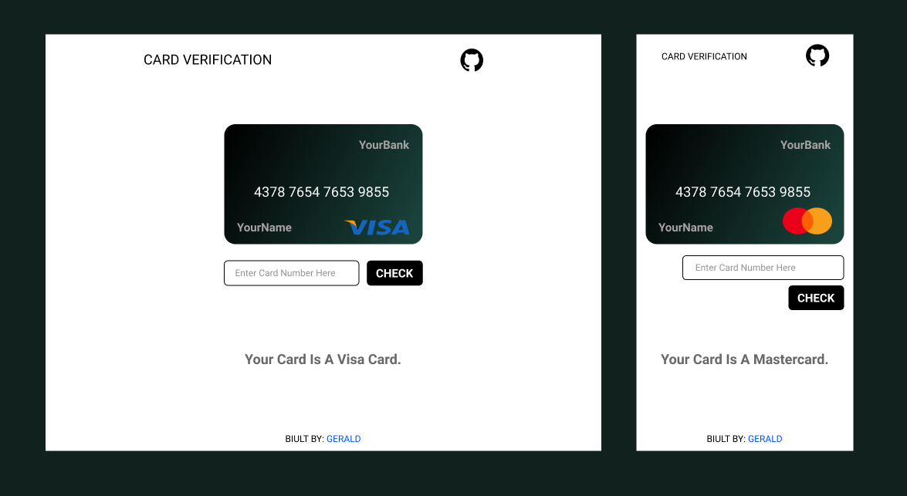

# card-verification

A JavaScript app that verifies card numbers using the " Luhn Algorithm"; currently works with VISA, Mastercard, American Express, and Discover cards.

[FIGMA DESIGN](https://www.figma.com/file/s2BX4SbeVbRuVLdINuiaq5/Card-Verification?node-id=13%3A2)

CHECK IT OUT [HERE](https://cardverification.vercel.app/)

 
FEEL FREE TO MAKE CHANGES AND MAKE A PULL REQUEST.:man_technologist:

 
Note: The number entered is to captured, saved or stored any where.
